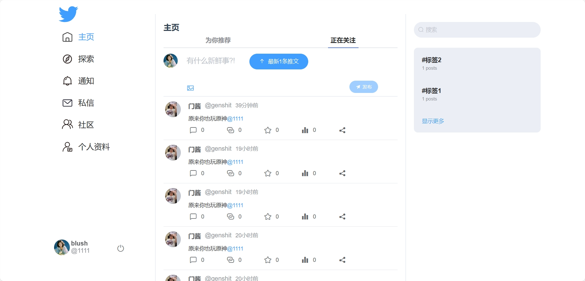
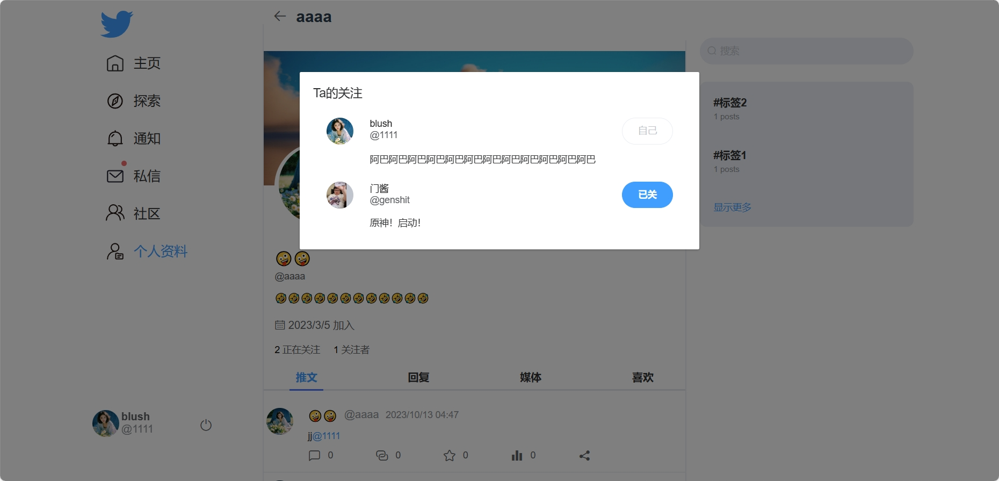
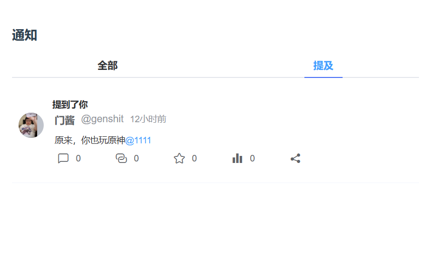
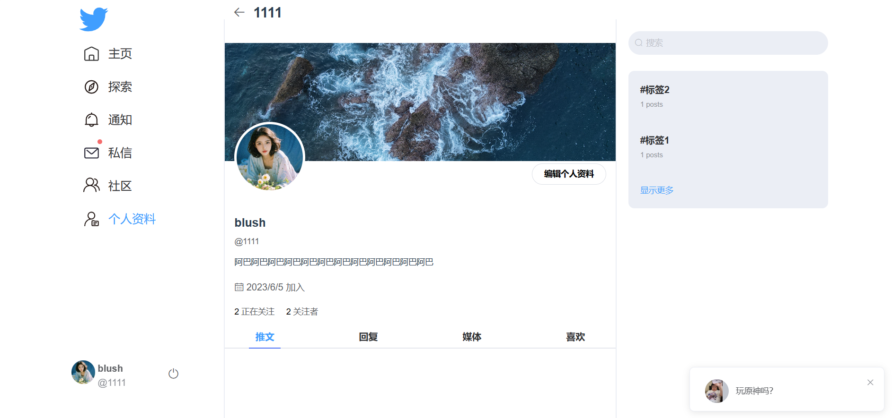
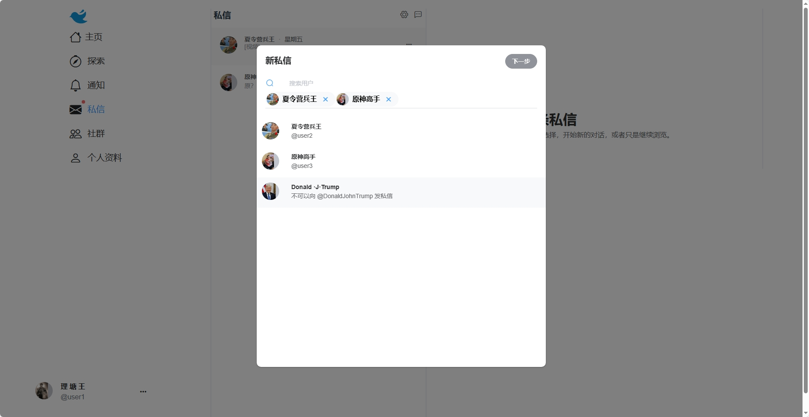
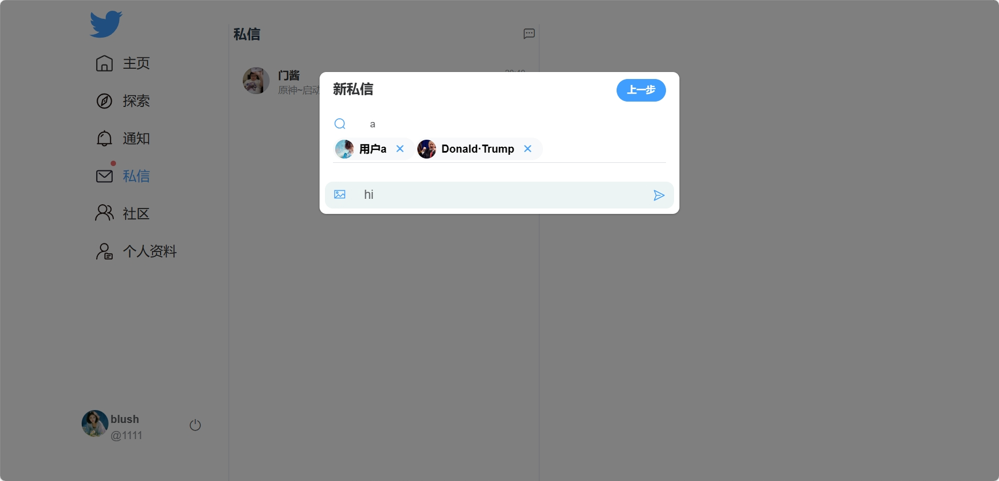
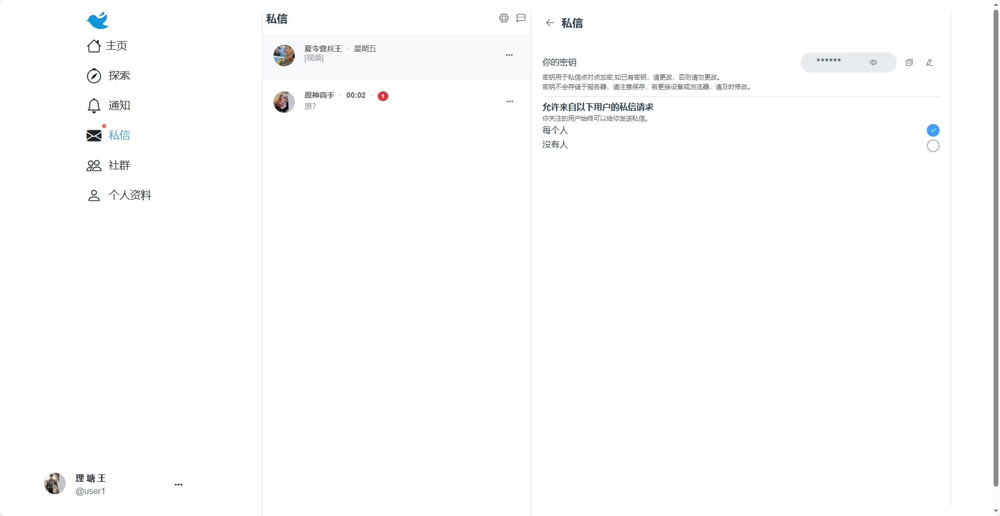
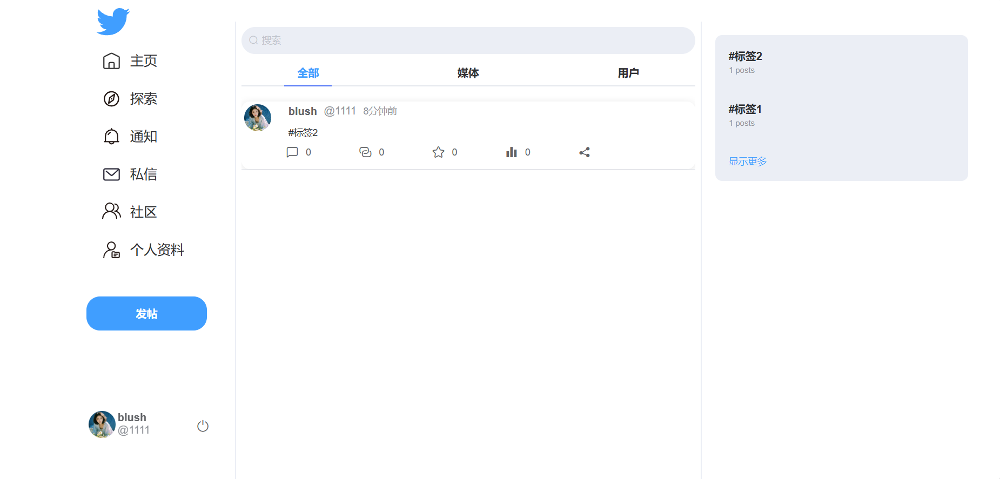

# Chirp

模仿Twitter的web应用，前端使用Vue2，后端使用Spring Cloud 
后端:[https://github.com/relzx766/Chirp-server](https://github.com/relzx766/Chirp-server)

### 注册

目前并没有实现oauth2

### 关注推送

### 编辑

### 回复

### 详情

### 引用

#### 弹窗

#### 显示

### 个人资料

#### 关注者

### 个人资料编辑

### 通知

#### 全部

#### 提及

### 私信
#### 新消息通知

#### 创建新私信

#### 下一步

#### 话题界面

#### 引用私信

#### 设置

### 趋势

### 搜索

