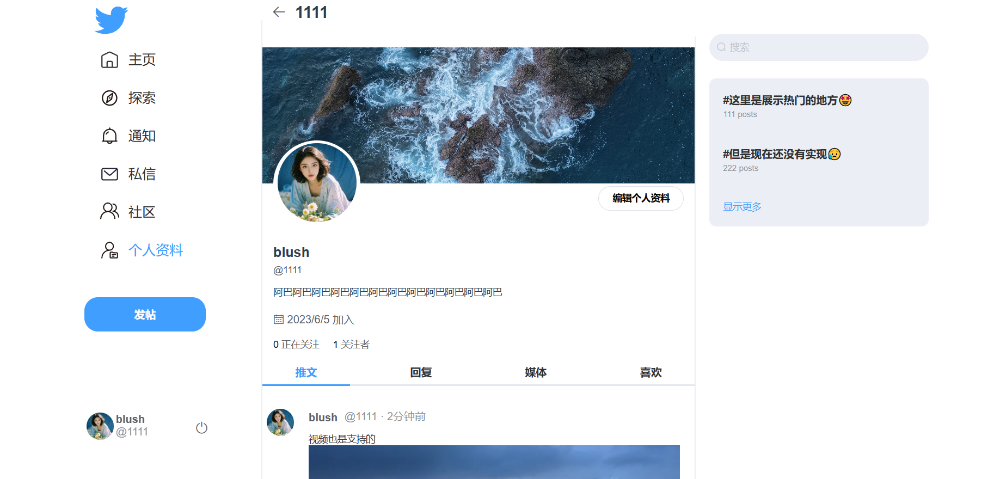
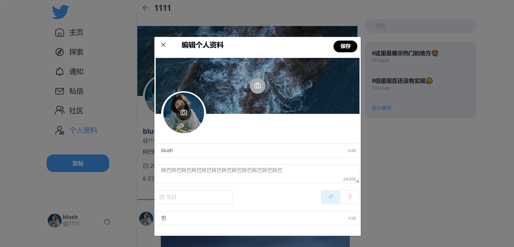
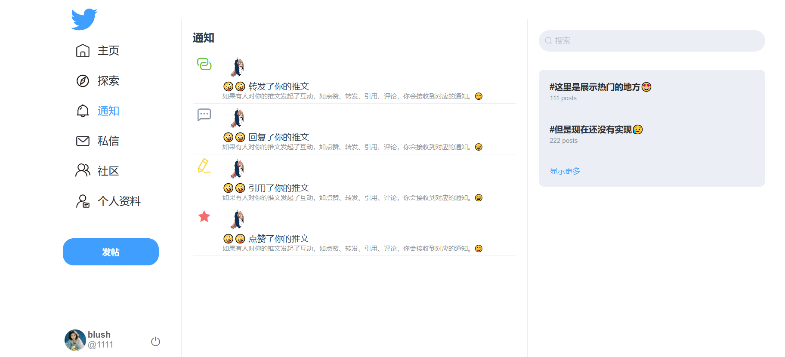

# Chirp

模仿Twitter的web应用，前端使用Vue2，后端使用Spring Cloud 
后端:[https://github.com/relzx766/Chirp-server](https://github.com/relzx766/Chirp-server)

### 注册

目前并没有实现oauth2

### 编辑

### 回复

### 详情

### 引用

弹窗 

显示 

### 个人资料

### 个人资料编辑

.

### 通知

