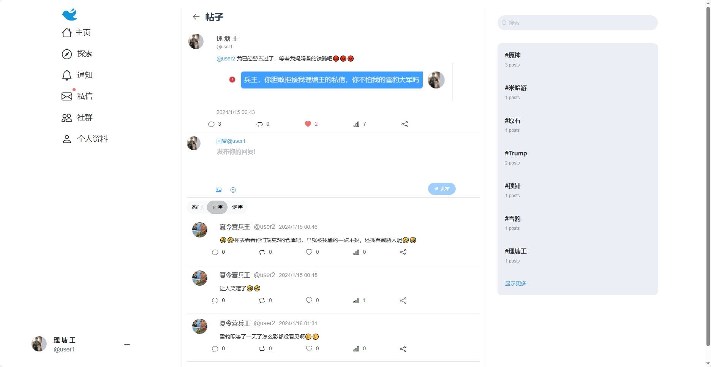
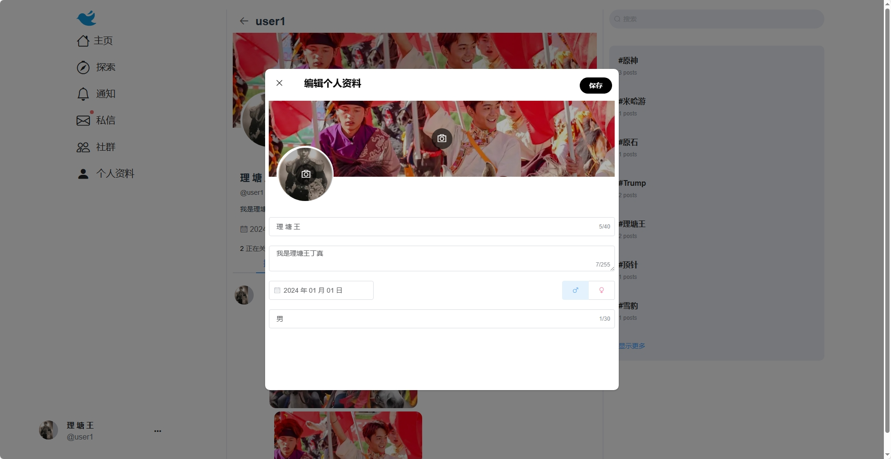
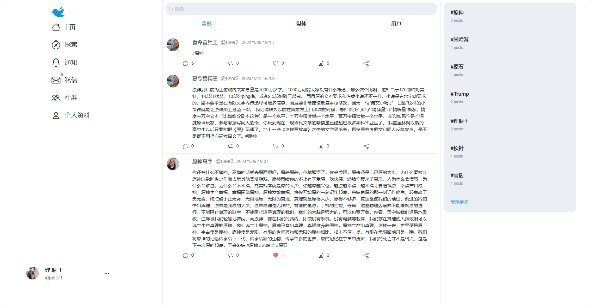

# Chirp

模仿Twitter的web应用，前端使用Vue2，后端使用Spring Cloud 
后端:[https://github.com/relzx766/Chirp-server](https://github.com/relzx766/Chirp-server)

### 注册

目前并没有实现oauth2

### 关注推送

### 编辑

### 详情

### 引用

### 个人资料

#### 关注者

### 个人资料编辑

### 通知

### 私信

#### 创建新私信

#### 话题界面

#### 设置

### 搜索

